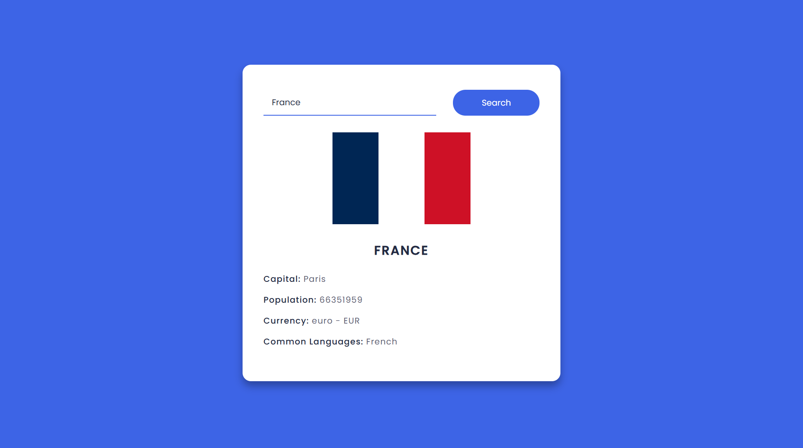

# 🌍 Country Info App

A clean and interactive country search web app that allows users to quickly find useful information about any country. By entering a country name, the app fetches real-time data from a public API and displays details such as the national flag, capital city, population, currency, and commonly spoken languages. The project is built using HTML, CSS, and Vanilla JavaScript, focusing on simplicity, responsive design, and smooth user experience. It was created to practice working with APIs, handling asynchronous JavaScript (Fetch), and dynamic DOM manipulation while building a modern and visually appealing interface.

---

## ✨ Features

* 🔍 Search any country by name
* 🏳️ Display country flag
* 🏙️ Show capital city
* 👥 Population info
* 💰 Currency details
* 🗣️ Common languages

---

## 🛠️ Tech Stack

* HTML
* CSS
* JavaScript
* REST Countries API

---

## 🚀 How to Use

1. Enter a country name in the search box
2. Click the search button
3. View detailed country information instantly

---

## 🎯 Purpose of the Project

This project was built to improve skills in:

* Working with public APIs
* Fetch and async JavaScript
* DOM manipulation
* Building clean UI with pure JavaScript

---

## 📸 Preview

*Add a screenshot here (example below):*

```md

```

---

## 👨‍💻 Author

Made with ❤️ by **Amir Mohammad**

If you like this project, consider giving it a ⭐ on GitHub!
